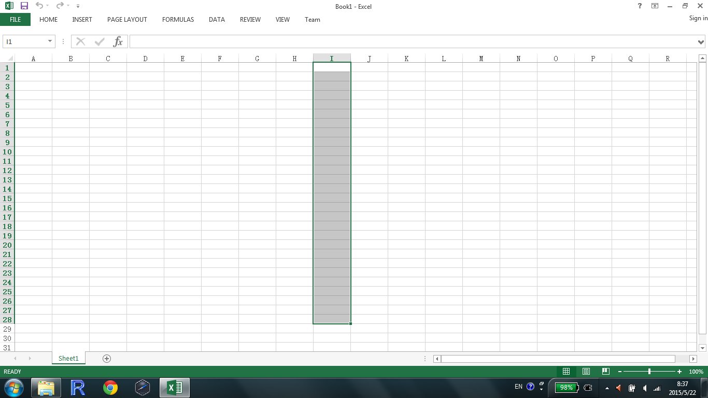
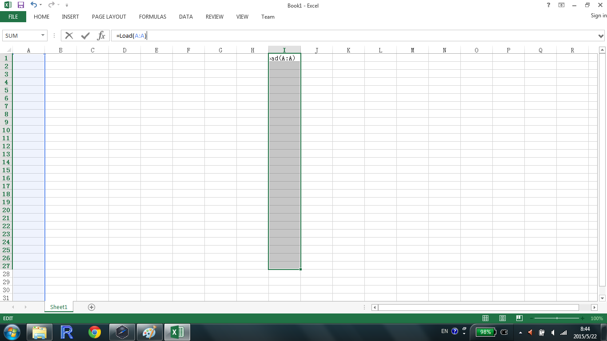
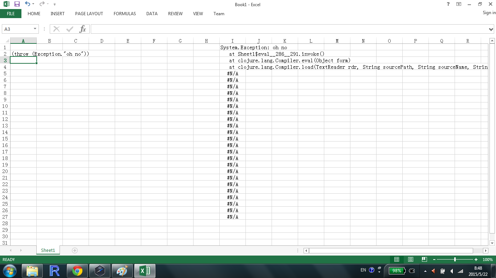

# Excel REPL

Boost your productivity with a full Clojure programming environment in Microsoft Excel

Excel REPL makes it easy to start a ClojureCLR Repl from within Excel.  Simply install it as an Excel Add-In to provide a few additional Excel Functions

## Download

[Installer](https://github.com/whamtet/Excel-REPL/releases/download/0.1/Excel-REPL.exe) (requires administrator permissions).

There is a [Manual Installer](https://github.com/whamtet/Excel-REPL/releases/download/0.1/Excel-REPL.zip) if you lack administrator permissions on your machine.

## Usage

Select output column



Type ```=Load(A:A)``` where A is the input column.  Press CTRL+SHIFT+ENTER, not just enter.



Create your first bug.  Excel-REPL splits the stack trace down the output column.

NB: Excel 2003 or earlier does not support entire column selection.  Type ```=Load(A1:A200)``` instead.



## Demo Spreadsheet.

Download [Excel-REPL.xlsx](https://github.com/whamtet/Excel-REPL/releases/download/0.1/Excel-REPL.xlsx) for a quick demo.
If this doesn't work correctly you must have an installation error.  Please contact the author straight away.

## Export

```clojure
(defn ^:export f [] ...)

(defn ^:export g ([] "No Args") ([x] "One Arg"))

(defn ^:export h [single-cell-argument [_ :as excel-array-argument]] ...)

(defn ^:export i [[[_] :as two-d-array] ...)

(require 'excel-repl.udf)
(excel-repl.udf/export-fns) ;exports the above functions
```

`excel-repl.udf/export-fns` will export as Excel user defined functions all functions with `^:export` metadata in the current namespace.  Functions with a single arglist are simply exported as their name.  Multiarity functions include the arity.  In the example above f will export `=F()` and g will export `=G0()` and `=G1(x)`.

Excel REPL assumes all arguments are passed as single cell selections (A1, B6 etc).  To indicate that an argument should be an array selection declare that argument with vector destructuring.  For 2D arrays use double destructuring.

`excel-repl.udf/export-fns` abuses Excel slightly and may fail on the first one or two invocations in a given session.

## Asynchronous Export

```clojure
(defn ^:export ^:async f [x] ...)
```
Asynchronous export caches on arguments to f.

## Read workbook

You may read values directly from the workbook

```clojure
(require '[excel-repl.interop :as interop])

(interop/get-values "MySheet" "A6")
(interop/get-values "AnotherSheet" "A6:B7")

```
Please see [interop.clj](https://github.com/whamtet/Excel-REPL/blob/master/Excel-REPL/nrepl/excel_repl/interop.clj) for the functions to manipulate the worksheet.

## Returning 1D and 2D arrays

If `Load` returns a 1 or 2 dimensional collection you may paste it into a range of Excel Cells.  To do so

1) Drag from the top left hand corner the number of cells for your output

2) Click in the formula bar and enter your formula

3) Press Control + Shift + Enter instead of simply enter

WARNING: Only `Load` can be used in this way.  If you return exported functions in this way Excel will crash.

## Error Messages

Errors are caught and returned as text within the output cells.  The stacktrace is split down the column so select multiple cells for output as mentioned above.

## Auxiliary Methods

Excel REPL adds useful functions and macros to clojure.core that are useful when interacting with a worksheet.  Please see [excel-repl.clj](https://github.com/whamtet/Excel-REPL/blob/master/Excel-REPL/excel-repl.clj) for details.

If you wish to pull stuff off the net straight into your worksheet [clr-http-lite](https://github.com/whamtet/clr-http-lite) is included

```clojure

(require '[clr-http.lite.client :as client])

(client/get "http://google.com")
=> {:status 200
    :headers {"date" "Sun, 01 Aug 2010 07:03:49 GMT"
              "cache-control" "private, max-age=0"
              "content-type" "text/html; charset=ISO-8859-1"
              ...}
    :body "<!doctype html>..."}

```

## Database

Excel REPL provides convenience methods for connecting directly to a mongo database

```clojure
(require '[excel-repl.coerce-db :as coerce-db])

(defonce connection (DB/Connect))

(DB/Set connection "test-values" (coerce-db/clojure->mongo {:hi "there"} ))
(-> connection (DB/Get "test-values") coerce-db/mongo->clojure str); {:hi "there"}
```

## NREPL

Excel REPL uses ClojureCLR which has less support than the main JVM implementation.  You may wish to connect to an external Clojure repl.  Both HTTP and TCP connections are supported.

```clojure
(require '[clojure.tools.nrepl :as nrepl])
(require '[clojure.data.drawbridge-client :as drawbridge-client]) ;Adds Http support to Nrepl

(def timeout 10000); 10 seconds
(def tcp-client (nrepl/client (nrepl/url-connect "nrepl://localhost:50000")) timeout)
(def http-client (nrepl/client (nrepl/url-connect "http://some.server/drawbridge-client")) timeout)

(defn remote-eval-str
"evaluates string on remote repl"
[code-str]
  (-> tcp-client
  (nrepl/message {:op "eval" :code code-str})
  nrepl/response-values))

(defmacro remote-eval [& body]
  `(first (remote-eval-str (nrepl/code ~@body))))

(remote-eval (+ 1 2)); 3
```

For information about connecting to a Clojure repl via Http, visit [Drawbridge](https://github.com/cemerick/drawbridge).

## NREPL Server

You may also use Excel-REPL as an nrepl server.  This makes it easy to push data over to the spreadsheet

```clojure
(require '[clojure.tools.nrepl.server :as server])
(defonce server (server/start-server))
```

## Build

The build process is a bit of a manual hack.  Please contact the author if you want help with this.

## System Requirements

Excel Repl works with Microsoft Excel 97+ (that's quite old) and Microsoft .NET 4.0 or 4.5.

## Gotchas

Be careful when spitting.  Excel sometimes runs the code several times, creating a race condition.  Use the following pattern

```clojure
(defonce o (Object.))
(locking o (spit my-file contents))
```
