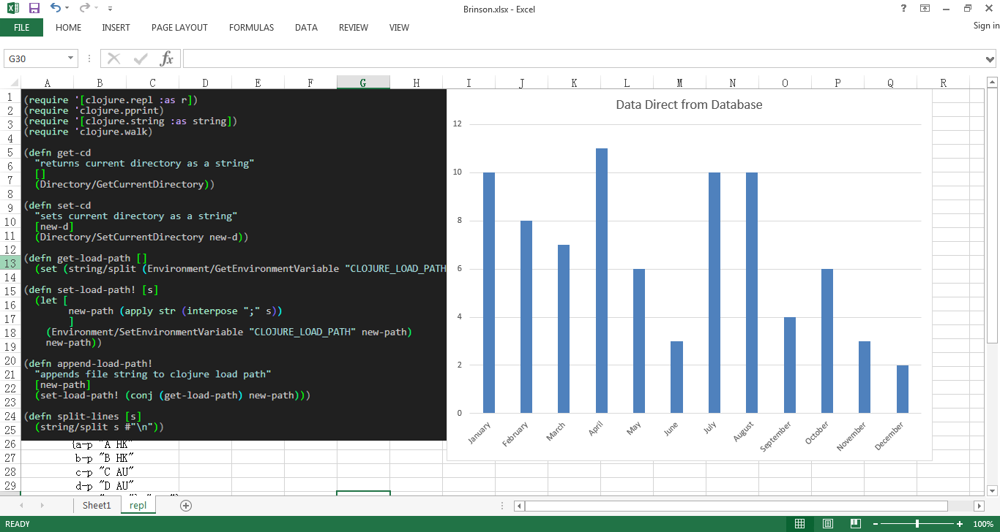

#Excel REPL

Boost your productivity with a full Clojure programming environment in Microsoft Excel



Excel REPL makes it easy to start a ClojureCLR Repl from within Excel.  Simply install it as an Excel Add-In to provide a few additional Excel Functions

##Load

    =Load(A:A)

Concatenates the contents of selected cells and evaluates them in namespace SheetName.  SheetName is the name of the current worksheet.

##Export

```clojure
(defn ^:export f [] ...)

(defn ^:export g ([] "No Args") ([x] "One Arg"))

(defn ^:export h [single-cell-argument [excel-array-argument]] ...)

(require 'excel-repl.udf)
(excel-repl.udf/export-fns) ;exports the above functions
```

`excel-repl.udf/export-fns` will export as Excel user defined functions all functions with `^:export` metadata in the current namespace.  Functions with a single arglist are simply exported as their name.  Multiarity functions include the arity.  In the example above f will export `=F()` and g will export `=G0()` and `=G1(x)`.

Excel REPL assumes all arguments are passed as single cell selections (A1, B6 etc).  To indicate that an argument should be an array selection declare that argument with vector destructuring.

`excel-repl.udf/export-fns` abuses Excel slightly and may fail on the first one or two invocations in a given session.

##Manipulate

Excel REPL makes it easy to dynamically manipulate the current workbook.  Use the `in-macro-context` so that the code is evaluated inside an anonymous (Excel) macro.  Setting cell values outside this will throw an exception, however you may read values at any point in your code.

```clojure
(require '[excel-repl.interop :as interop])
(require '[excel-repl.udf :as udf])

(udf/in-macro-context (interop/insert-formula "D3:E4" "=1+2"))

(udf/in-macro-context (interop/get-values "MySheet!A6"))

```
Please see [interop.clj](https://github.com/whamtet/Excel-REPL/blob/master/Excel-REPL/nrepl/excel_repl/interop.clj) for the functions to manipulate the worksheet.

##Returning 1D and 2D arrays

If your function returns a 1 or 2 dimensional collection you may paste it into a range of Excel Cells.  To do so

1) Drag from the top left hand corner the number of cells for your output

2) Click in the formula bar and enter your formula

3) Press Control + Shift + Enter instead of simply enter

##Error Messages

Errors are caught and returned as text within the output cells.  The stacktrace is split down the column so select multiple cells for output as mentioned above.

##Auxilliary Methods

Excel REPL adds useful functions and macros to clojure.core that are useful when interacting with a worksheet.  Please see [excel-repl.clj](https://github.com/whamtet/Excel-REPL/blob/master/Excel-REPL/excel-repl.clj) for details.

If you wish to pull stuff off the net straight into your worksheet [clr-http-lite](https://github.com/whamtet/clr-http-lite) is included

```clojure

(require '[clr-http.lite.client :as client])

(client/get "http://google.com")
=> {:status 200
    :headers {"date" "Sun, 01 Aug 2010 07:03:49 GMT"
              "cache-control" "private, max-age=0"
              "content-type" "text/html; charset=ISO-8859-1"
              ...}
    :body "<!doctype html>..."}

```

##Database

Excel REPL provides convenience methods for connecting directly to a mongo database

```clojure
(require '[excel-repl.coerce-db :as coerce-db])

(defonce connection (DB/Connect))

(DB/Set connection "test-values" (coerce-db/clojure->mongo {:hi "there"} ))
(-> connection (DB/Get "test-values") coerce-db/mongo->clojure str); {:hi "there"}
```

##NREPL

Excel REPL uses ClojureCLR which has less support than the main JVM implementation.  You may wish to connect to an external Clojure repl.  Both HTTP and TCP connections are supported.

```clojure
(require '[clojure.tools.nrepl :as nrepl])
(require '[clojure.data.drawbridge-client :as drawbridge-client]) ;Adds Http support to Nrepl

(def tcp-client (nrepl/client (nrepl/url-connect "nrepl://localhost:50000")))
(def http-client (nrepl/client (nrepl/url-connect "http://some.server/drawbridge-client")))

(defn remote-eval-str
"evaluates string on remote repl"
[code-str]
  (-> tcp-client
  (nrepl/message {:op "eval" :code code-str})
  nrepl/response-values))

(defmacro remote-eval [& body]
  `(first (remote-eval-str (nrepl/code ~@body))))

(remote-eval (+ 1 2)); 3
```

For information about connecting to a Clojure repl via Http, visit [Drawbridge](https://github.com/cemerick/drawbridge).

##Build and Installation

The build process is a bit of a manual hack.  Please contact the author if you want help with this.

To install on a machine copy the contents of Excel-REPL/bin/Debug into ~/AppData/Roaming/Microsoft/AddIns and then add via the Excel add-ins menu.  Excel-REPL will then auto-load every time you start Excel.

##System Requirements

Excel Repl works with Microsoft Excel 97+ (that's quite old) and Microsoft .NET 4.0 or 4.5.

##Good Riddance VBA

What a crap language.  Lisp existed then, so why did Microsoft create VBA?  Because they're Microsoft.
