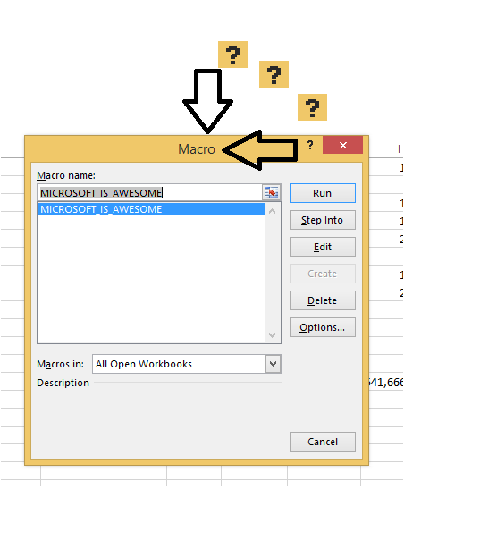

#Excel REPL


```clojure
;This is a macro
(defmacro kick-some-ass [how-much?]
  `(do ~@(repeat how-much? '(kick-ass!))))
```


As much as we all love VBA there are better languages available such as ... Clojure.  Excel REPL makes it easy to start a ClojureCLR Repl from within Excel.  Simply install it as an Excel Add-In to provide two additional Excel Functions

##Load

    =Load(A:A)

Concatenates the contents of selected cells and evaluates them in namespace SheetName.  SheetName is the name of the current worksheet.

##Invoke

    =Invoke1("myFunction", A1)
    =Invoke2("myFunction", A2:A5, C6)
    ...

Invokes myFunction with the supplied arguments and returns the result.  Range arguments are provided as a Clojure vector unless the range is of length one, in which case they are the same as a single cell argument.

Arity cannot be overloaded so you must use Invoke1, Invoke2 etc.  For functions with zero arguments simply use Load.

##Returning 1D and 2D arrays

If your function returns a 1 or 2 dimensional collection you may paste it into a range of Excel Cells.  To do so

1) Drag from the top left hand corner the number of cells for your output

2) Click in the formula bar and enter your formula

3) Press Control + Shift + Enter instead of simply enter

##Error Messages

Errors are caught and returned as text within the output cells.  The stacktrace is split down the column so select multiple cells for output as mentioned above.

##Auxilliary Methods

ClojureCLR does not implement slurp for http by default.  Use the Auxilliary class as follows

```clojure
(import ClojureExcel.AuxClass)

(AuxClass/slurpSite "http://www.google.com")
```

NREPL is included to connect with an external Clojure process

```clojure
(require '[clojure.tools.nrepl :as nrepl])

(defn remote-eval [code]
  (with-open [
              conn (nrepl/url-connect "nrepl://localhost:63487")
              ]
    (->
     (nrepl/client conn 10000)    ; message receive timeout required
     (nrepl/message {:op "eval" :code code})
     nrepl/response-values)))

(remote-eval "(def b 3)")
```

##Build and Installation

Create a Visual Studio C Sharp Class Project and add the two C Sharp source files.  Use Visual Studio's package manager NuGet to install Clojure and Excel-DNA dependencies.

To install on a machine copy the contents of Excel-REPL/bin/Debug into ~/AppData/Roaming/Microsoft/AddIns and then add via the Excel add-ins menu.  Excel-REPL will then auto-install every time you start Excel.

##System Requirements

Excel Repl works with Microsoft Excel 97+ (that's quite old) and Microsoft .NET 4.0 or 4.5.

##Good Riddance VBA

What a crap language.  Lisp existed then, so why did Microsoft create VBA?  Because they're Microsoft.
